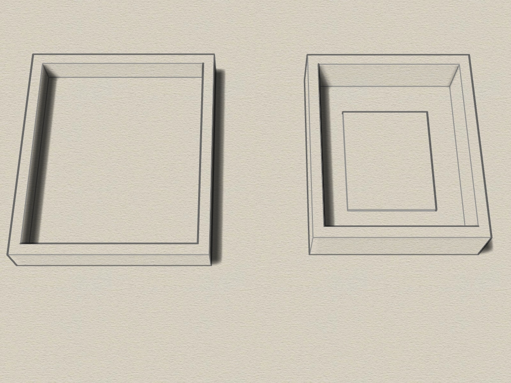
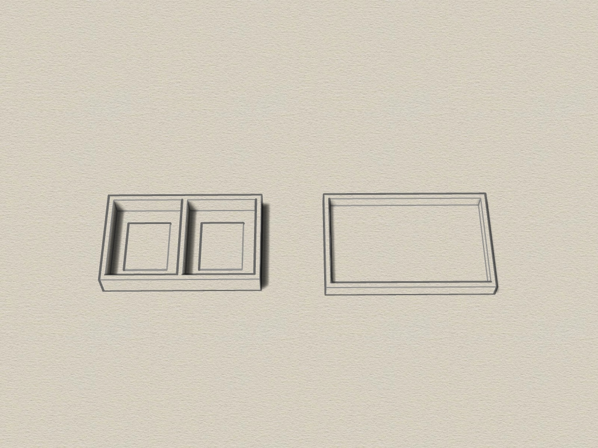
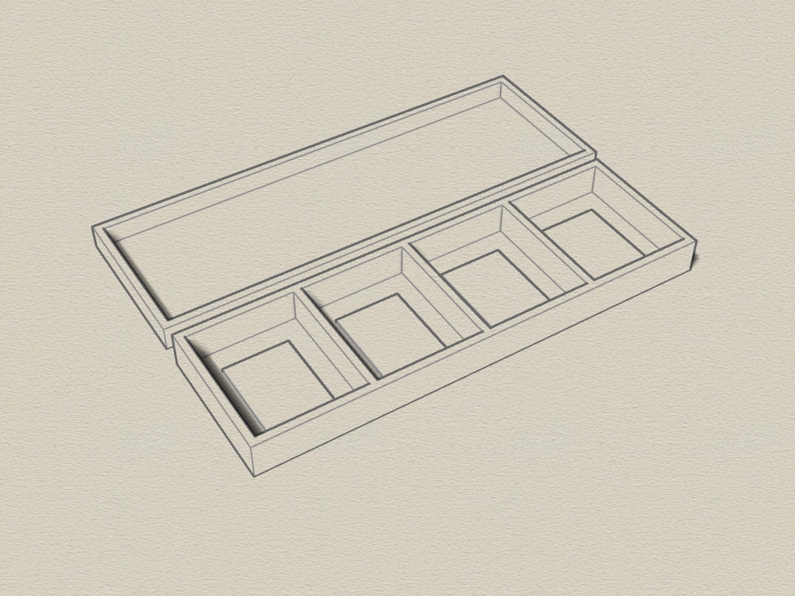

# PLCC32 EEPROM case
3D printable enclosure for PLCC32 EEPROM Chips, created with Rhino 6.

#### 3D Case
The enclosure consists of 2 parts which are clamped together (no screws). There are cases for up to 5 Chips.
I use this housing when sending chips through the mail. 

Requirements:
* 3D printer 
* Filament of your choice

#### View
 
 

